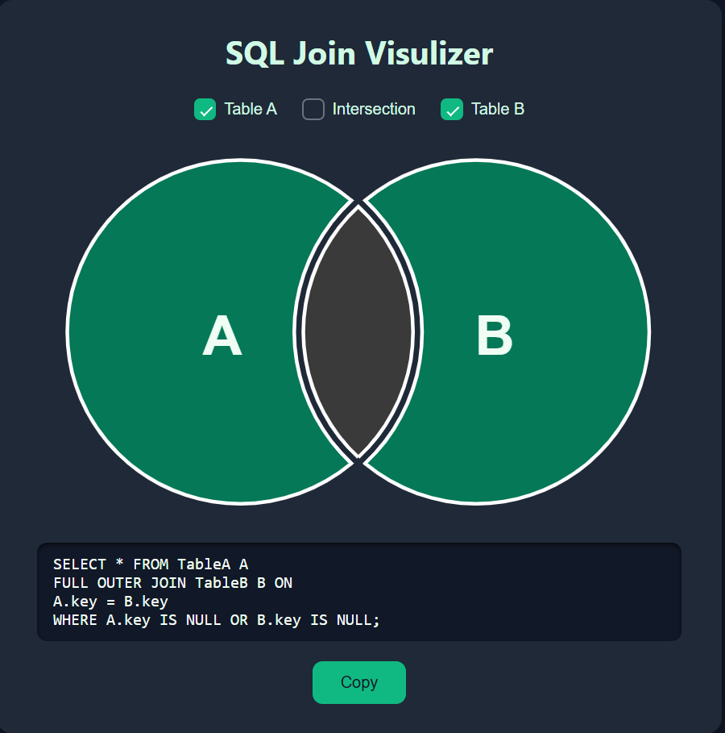

# SQL Join Visualizer

A **visual interactive tool** to help you understand SQL JOIN operations with **live visualization** of Table A, Table B, and their intersections. Select checkboxes to see the corresponding SQL query generated dynamically.

---

## Table of Contents
- [Features](#features)  
- [Demo](#demo)  
- [Installation](#installation)  
- [Usage](#usage)  
- [Technologies](#technologies)  

---

## Features
- ✅ **Interactive checkboxes** for Table A, Table B, and Intersection.  
- ✅ **Dynamic SQL query generation** based on checkbox selection.  
- ✅ **SVG visualization** of LEFT JOIN, RIGHT JOIN, FULL OUTER JOIN, INNER JOIN, and intersections.  
- ✅ **Clean dark green theme** for better readability.  
- ✅ **Copy SQL** button to quickly copy the generated query.  
- ✅ **ASCII art fun**: sleeping cat output for visual flavor.  

---

## Demo

  
*Select the checkboxes to see queries update dynamically and circles highlight joins.*

---

## Installation

1. Clone the repository:

```bash
git clone https://github.com/shubhamselakoti/SQL-join-Query.git
cd sql-join-query
```

2. Open `index.html` in your browser:

```bash
open index.html
# or just double-click the file
```

No server or backend needed. Fully **client-side HTML/CSS/JS**.

---

## Usage

1. **Open the tool** in your browser.  
2. **Select one or more checkboxes**:  
   - Table A  
   - Table B  
   - Intersection  
3. **Observe the SVG visualization**:  
   - Left circle → Table A  
   - Right circle → Table B  
   - Intersection → overlapping region  
4. **Generated SQL appears in the output area**, preserving line breaks.  
5. **Click “Copy”** to copy the SQL query to clipboard.  

---

### Examples

- **All checked (Table A + Table B + Intersection)**

```sql
SELECT * FROM TableA A
OUTER JOIN TableB B ON
A.key = B.key;
```

- **Table A + Table B**

```sql
SELECT * FROM TableA A
FULL OUTER JOIN TableB B ON
A.key = B.key
WHERE A.key IS NULL OR B.key IS NULL;
```

- **Intersection only**

```sql
SELECT * FROM TableA A
INNER JOIN TableB B ON
A.key = B.key;
```

---

## Technologies
- HTML5  
- CSS3 (Dark green theme)  
- JavaScript (ES6)  
- SVG for interactive circle visualization  

---

## Project Structure
```
sql-join-visualizer/
│
├─ index.html        # Main HTML file
├─ style.css         # Styles including dark green theme
├─ app.js            # JavaScript logic for interactivity
└─ README.md         # Project documentation
```


